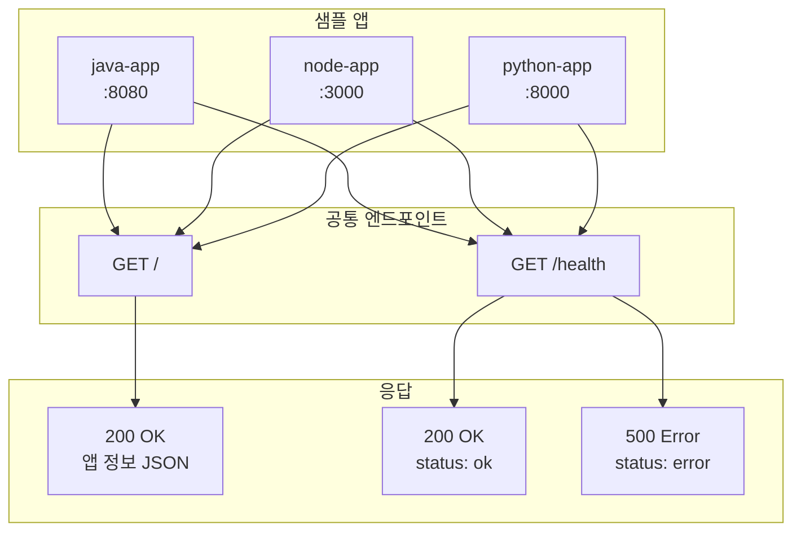
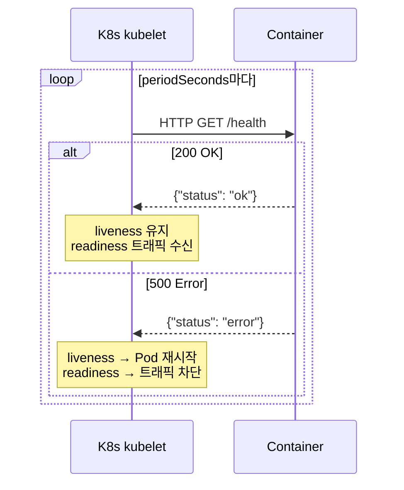
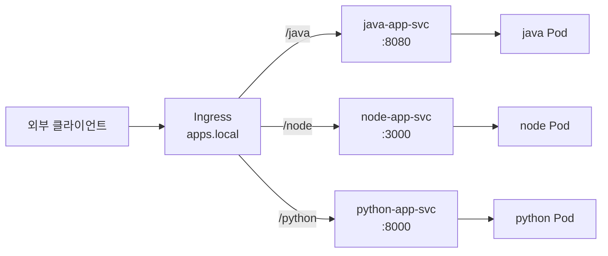

# API 명세 개요

> 문서 버전: 1.1.0
> 최종 수정: 2026-04-06
> 작성: docs 에이전트
> 관련 요구사항: [기능 요구사항 §1](../requirements/functional.md), [제약조건 §1](../requirements/constraints.md)

---

## 1. 개요

본 프로젝트는 GitOps CI/CD 파이프라인 검증을 위한 **Stateless 샘플 애플리케이션** 3개로 구성된다.
DB 연동이 없으며, 각 앱은 공통된 엔드포인트 구조를 따른다.

| 앱 | 언어 / 프레임워크 | 로컬 포트 | Ingress 경로 |
|----|-----------------|-----------|-------------|
| java-app | Java 17 / Spring Boot 3.x | `8080` | `/java` |
| node-app | Node.js 18+ / Express | `3000` | `/node` |
| python-app | Python 3.11+ / FastAPI | `8000` | `/python` |

### 전체 API 구조



---

## 2. 공통 규칙

### 2.1 응답 형식

- 모든 응답은 **JSON** 형식 (`Content-Type: application/json`)
- 문자 인코딩: **UTF-8**
- 날짜/시간 형식: **ISO 8601** (`2026-04-06T00:00:00Z`)

### 2.2 HTTP 상태 코드

| 코드 | 의미 | 사용 시점 |
|------|------|---------|
| `200 OK` | 정상 응답 | 모든 정상 GET 요청 |
| `404 Not Found` | 리소스 없음 | 존재하지 않는 경로 요청 |
| `405 Method Not Allowed` | 허용되지 않는 메서드 | POST/PUT/DELETE 요청 |
| `500 Internal Server Error` | 서버 내부 오류 | 예상치 못한 오류 |

### 2.3 에러 응답 형식

```json
{
  "status": "error",
  "code": 404,
  "message": "Not Found",
  "path": "/unknown-path"
}
```

| 필드 | 타입 | 설명 |
|------|------|------|
| `status` | `string` | 항상 `"error"` |
| `code` | `integer` | HTTP 상태 코드 |
| `message` | `string` | 오류 설명 |
| `path` | `string` | 요청 경로 |

---

## 3. 공통 엔드포인트

### 3.1 GET / — 앱 기본 정보

앱의 식별 정보와 현재 환경 정보를 반환한다.

#### 요청

```
GET /
Host: <app-host>
```

#### 응답 (200 OK)

```json
{
  "app": "java-app",
  "version": "1.0.0",
  "language": "Java",
  "framework": "Spring Boot 3.x",
  "port": 8080,
  "environment": "production"
}
```

#### 응답 필드 정의

| 필드 | 타입 | 필수 | 설명 |
|------|------|:----:|------|
| `app` | `string` | ✅ | 앱 식별 이름 |
| `version` | `string` | ✅ | 앱 버전 (예: `"1.0.0"`) |
| `language` | `string` | ✅ | 구현 언어 |
| `framework` | `string` | ✅ | 사용 프레임워크 |
| `port` | `integer` | ✅ | 앱 실행 포트 |
| `environment` | `string` | — | 실행 환경 (`"development"` / `"production"`) |

#### 앱별 응답 예시

**java-app (port 8080)**

```json
{ "app": "java-app", "version": "1.0.0", "language": "Java",
  "framework": "Spring Boot 3.x", "port": 8080, "environment": "production" }
```

**node-app (port 3000)**

```json
{ "app": "node-app", "version": "1.0.0", "language": "Node.js",
  "framework": "Express", "port": 3000, "environment": "production" }
```

**python-app (port 8000)**

```json
{ "app": "python-app", "version": "1.0.0", "language": "Python",
  "framework": "FastAPI", "port": 8000, "environment": "production" }
```

---

### 3.2 GET /health — 헬스체크

K8s liveness/readiness probe 및 배포 상태 확인에 사용된다.

#### 요청

```
GET /health
Host: <app-host>
```

#### 응답 (200 OK) — 정상

```json
{ "status": "ok", "app": "java-app", "version": "1.0.0" }
```

#### 응답 (500 Internal Server Error) — 비정상

```json
{ "status": "error", "app": "java-app", "version": "1.0.0",
  "message": "Service unavailable" }
```

#### 응답 필드 정의

| 필드 | 타입 | 필수 | 설명 |
|------|------|:----:|------|
| `status` | `string` | ✅ | `"ok"` (정상) / `"error"` (비정상) |
| `app` | `string` | ✅ | 앱 식별 이름 |
| `version` | `string` | ✅ | 앱 버전 |
| `message` | `string` | — | 비정상 시 오류 메시지 |

#### Probe 연동 흐름



#### K8s Probe 설정 예시

```yaml
livenessProbe:
  httpGet:
    path: /health
    port: 8080        # 앱별 포트
  initialDelaySeconds: 30   # java: 30s / node·python: 10s
  periodSeconds: 10
  failureThreshold: 3

readinessProbe:
  httpGet:
    path: /health
    port: 8080
  initialDelaySeconds: 10
  periodSeconds: 5
  failureThreshold: 3
```

---

## 4. K8s Ingress 경로 라우팅 규칙

### 4.1 경로 규칙

클러스터 내부에서는 각 앱의 Service 포트로 직접 접근하고,
외부에서는 Ingress를 통해 경로 기반으로 라우팅한다.

| 외부 경로 | 대상 Service | 대상 포트 |
|----------|-------------|---------|
| `/java` 또는 `/java/*` | `java-app-svc` | `8080` |
| `/node` 또는 `/node/*` | `node-app-svc` | `3000` |
| `/python` 또는 `/python/*` | `python-app-svc` | `8000` |

#### Ingress 라우팅 흐름



### 4.2 Ingress 매니페스트 예시

```yaml
apiVersion: networking.k8s.io/v1
kind: Ingress
metadata:
  name: apps-ingress
  namespace: apps
  annotations:
    nginx.ingress.kubernetes.io/rewrite-target: /$2
spec:
  ingressClassName: nginx
  rules:
    - host: apps.local
      http:
        paths:
          - path: /java(/|$)(.*)
            pathType: ImplementationSpecific
            backend:
              service:
                name: java-app-svc
                port:
                  number: 8080
          - path: /node(/|$)(.*)
            pathType: ImplementationSpecific
            backend:
              service:
                name: node-app-svc
                port:
                  number: 3000
          - path: /python(/|$)(.*)
            pathType: ImplementationSpecific
            backend:
              service:
                name: python-app-svc
                port:
                  number: 8000
```

### 4.3 경로 접근 예시

| 요청 URL | 실제 라우팅 대상 |
|---------|----------------|
| `GET http://apps.local/java` | `java-app-svc:8080/` |
| `GET http://apps.local/java/health` | `java-app-svc:8080/health` |
| `GET http://apps.local/node` | `node-app-svc:3000/` |
| `GET http://apps.local/node/health` | `node-app-svc:3000/health` |
| `GET http://apps.local/python` | `python-app-svc:8000/` |
| `GET http://apps.local/python/health` | `python-app-svc:8000/health` |

### 4.4 로컬 vs EKS 환경 차이

| 항목 | 로컬 k3s | AWS EKS |
|------|---------|---------|
| 도메인 | `apps.local` (`/etc/hosts` 등록) | 실제 도메인 또는 ALB DNS |
| IngressClass | `nginx` 또는 `traefik` | `nginx` 또는 `alb` |
| TLS | 미적용 | ACM 인증서 연동 |
| 경로 규칙 | 동일 | 동일 |

---

## 5. 앱별 포트 요약

| 앱 | 컨테이너 포트 | Service 포트 | Ingress 경로 |
|----|:-----------:|:-----------:|------------|
| java-app | `8080` | `8080` | `/java` |
| node-app | `3000` | `3000` | `/node` |
| python-app | `8000` | `8000` | `/python` |

---

## 6. 로컬 직접 접근 (개발/디버깅)

K8s 환경 없이 로컬에서 직접 실행 시 접근 방법:

```bash
# java-app
curl http://localhost:8080/
curl http://localhost:8080/health

# node-app
curl http://localhost:3000/
curl http://localhost:3000/health

# python-app
curl http://localhost:8000/
curl http://localhost:8000/health
```

---

## 7. 구현 참고 사항

### 7.1 앱별 라우트 구현 포인트

**GET / 구현**

| 앱 | 구현 방법 |
|----|---------|
| java-app | `@RestController` + `@GetMapping("/")` |
| node-app | `app.get('/', handler)` |
| python-app | `@app.get("/")` |

**GET /health 구현**

| 앱 | 구현 방법 |
|----|---------|
| java-app | `@GetMapping("/health")` |
| node-app | `app.get('/health', handler)` |
| python-app | `@app.get("/health")` |

### 7.2 환경 변수로 버전 주입 (권장)

컨테이너 이미지 빌드 시 git SHA를 환경 변수로 주입하여 응답에 활용:

```yaml
# Deployment 환경 변수
env:
  - name: APP_VERSION
    value: "a1b2c3d"   # CI에서 git SHA로 치환
  - name: APP_ENV
    value: "production"
```

```dockerfile
# Dockerfile — 빌드 시 ARG로 주입
ARG APP_VERSION=latest
ENV APP_VERSION=${APP_VERSION}
```
