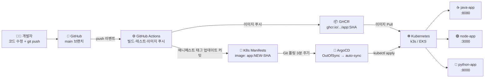
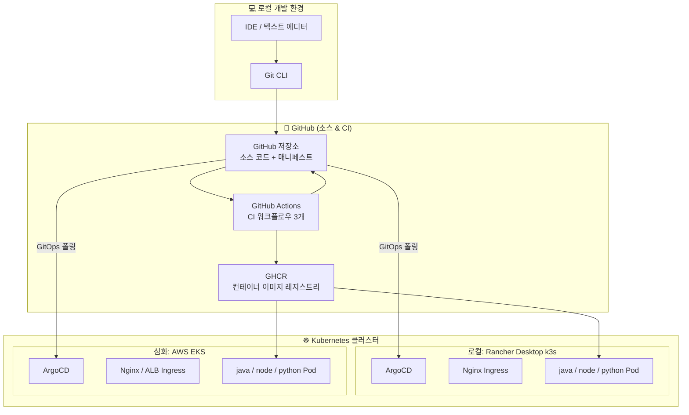
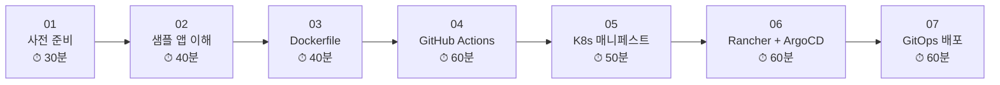
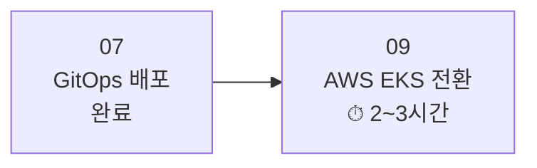

# 00. 전체 과정 소개 — GitOps CI/CD 파이프라인

> 가이드 버전: 1.0.0  
> 최종 수정: 2026-04-04  
> 상태: ✅ 완료

---

## 🎯 학습 목표

이 과정을 완료하면 다음을 이해하고 실습할 수 있습니다:

- [ ] GitOps 기반 CI/CD 파이프라인의 전체 구조와 데이터 흐름을 설명할 수 있다
- [ ] GitHub Actions(CI) → GHCR → ArgoCD(CD) → Kubernetes 연결 방식을 이해한다
- [ ] 로컬 Rancher Desktop(k3s)에서 3개 샘플 앱을 자동 배포할 수 있다
- [ ] (심화) 동일한 파이프라인을 AWS EKS 환경으로 전환할 수 있다

---

## 📖 이론

### 이 과정에서 배울 것

이 교육 과정은 **Git + GitHub Actions + ArgoCD**를 활용한 GitOps CI/CD 파이프라인을 처음부터 직접 구축하는 과정입니다.

| 항목 | 내용 |
|------|------|
| **대상** | CI/CD 입문자, 백엔드·인프라 개발자 |
| **목표** | 코드 변경이 자동으로 K8s 클러스터에 배포되는 파이프라인 완성 |
| **방식** | 이론 설명 → 실습 → 확인 체크리스트 반복 |
| **환경** | macOS + Rancher Desktop(k3s) → (심화) AWS EKS |
| **기간** | 기본 과정(01~07): 약 4~6시간 / 심화(09): 약 2~3시간 추가 |

---

### 아키텍처 다이어그램

#### CI/CD 전체 흐름

#### 기술 스택 구성도

---

### 기술 스택 소개

| 역할 | 기술 | 버전 | 설명 |
|------|------|------|------|
| **샘플 앱 (백엔드)** | Java / Spring Boot | Java 17+, Spring Boot 3.x | REST API 샘플 앱 |
| **샘플 앱 (백엔드)** | Node.js / Express | Node.js 18+ | REST API 샘플 앱 |
| **샘플 앱 (백엔드)** | Python / FastAPI | Python 3.11+ | REST API 샘플 앱 |
| **컨테이너화** | Docker | — | 멀티스테이지 이미지 빌드 |
| **CI** | GitHub Actions | — | 빌드/테스트/이미지 푸시 자동화 |
| **이미지 레지스트리** | GitHub Container Registry (GHCR) | — | `ghcr.io/<org>/<app>:<sha>` |
| **CD** | ArgoCD | — | GitOps 기반 자동 배포 |
| **매니페스트** | plain YAML | — | Helm 미사용, 순수 K8s YAML |
| **로컬 K8s** | Rancher Desktop (k3s) | v1.34+ | macOS 로컬 클러스터 |
| **클라우드 K8s** | AWS EKS | — | 심화 과정 전환 대상 |
| **Ingress** | Nginx Ingress Controller | — | 경로 기반 라우팅 |

---

### 학습 흐름 (가이드 순서)

#### 기본 과정 (로컬 k3s) — 약 4~6시간

#### 심화 과정 (AWS EKS) — 약 2~3시간 추가

#### 가이드별 상세 정보

| 번호 | 가이드 | 핵심 내용 | 예상 소요 시간 |
|------|--------|---------|------------|
| [01](01-prerequisites.md) | 사전 준비 | Rancher Desktop, kubectl, Git, GitHub PAT 설치/설정 | 30분 |
| [02](02-sample-apps.md) | 샘플 앱 이해 | 3개 앱 코드 분석, 로컬 실행, API 응답 확인 | 40분 |
| [03](03-dockerize.md) | Dockerfile + 이미지 빌드 | 멀티스테이지 빌드, 로컬 빌드, GHCR 푸시 | 40분 |
| [04](04-github-actions.md) | GitHub Actions CI | 워크플로우 구조, 트리거, Job 의존성, 시크릿 설정 | 60분 |
| [05](05-k8s-manifests.md) | K8s 매니페스트 | Deployment/Service/Ingress 분석, probe, 리소스 제한 | 50분 |
| [06](06-rancher-argocd.md) | Rancher Desktop + ArgoCD | k3s 구성, Nginx Ingress 설치, ArgoCD 설치 및 Application CR | 60분 |
| [07](07-gitops-deploy.md) | GitOps 배포 실습 | 전체 파이프라인 E2E 체험, self-healing, 롤백 | 60분 |
| [09](09-aws-eks.md) | (심화) AWS EKS 전환 | EKS 클러스터 생성, 매니페스트 수정, 전환 검증 | 2~3시간 |

---

### 사전 지식 수준

| 분야 | 필요 수준 | 비고 |
|------|---------|------|
| **Git** | ✅ 필수 | `add / commit / push / pull / branch` 기본 사용 가능 |
| **터미널 (CLI)** | ✅ 필수 | 파일 탐색, 명령어 실행, 환경변수 설정 가능 |
| **Docker** | 🟡 권장 | 기본 개념 이해 수준 (실습 경험 없어도 무방) |
| **YAML** | 🟡 권장 | 기본 문법(들여쓰기, 키-값) 이해 |
| **K8s** | ❌ 불필요 | 이 과정에서 처음부터 설명 |
| **ArgoCD** | ❌ 불필요 | 이 과정에서 처음부터 설명 |
| **AWS** | ❌ 불필요 (09번만 필요) | 심화 과정에서만 필요 |

---

## 🛠️ 실습 단계

이 문서는 개요 가이드이므로 별도 실습 단계가 없습니다.  
[01. 사전 준비](01-prerequisites.md) 가이드로 이동하여 실습을 시작하세요.

---

## ✅ 확인 체크리스트

- [ ] 전체 CI/CD 아키텍처 다이어그램을 보고 데이터 흐름을 설명할 수 있다
- [ ] 각 기술 스택(GitHub Actions / GHCR / ArgoCD / k3s)의 역할을 1문장으로 설명할 수 있다
- [ ] 사전 지식 수준을 확인하고 부족한 부분을 파악했다
- [ ] 전체 학습 소요 시간을 확인했다
- [ ] [01. 사전 준비](01-prerequisites.md) 가이드로 진행할 준비가 되었다
