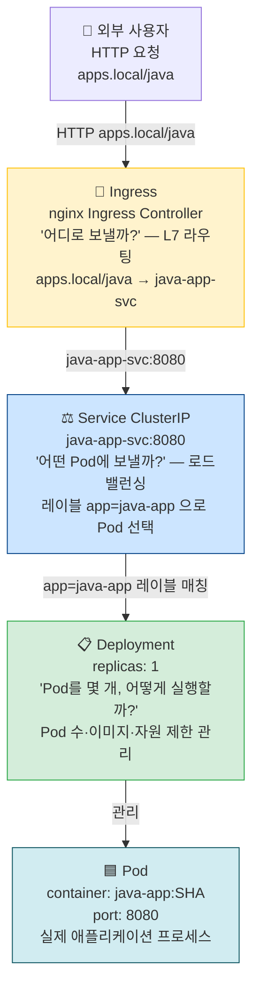
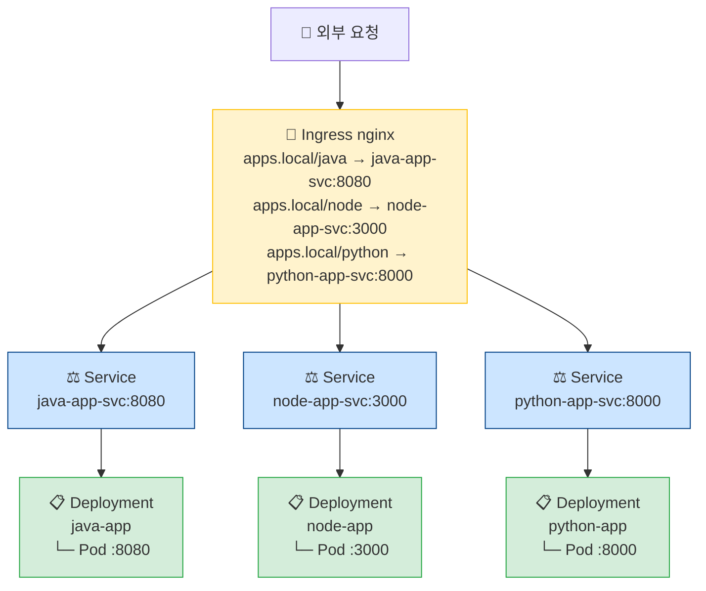

# 05. K8s 매니페스트 작성

> 가이드 버전: 1.0.0  
> 최종 수정: 2026-04-04  
> 상태: ✅ 실습 단계 작성 완료  
> 이전 가이드: [04. GitHub Actions CI](04-github-actions.md) | 다음 가이드: [06. Rancher Desktop + ArgoCD](06-rancher-argocd.md)

---

## 🎯 학습 목표

이 가이드를 완료하면 다음을 할 수 있습니다:

- [ ] Deployment / Service / Ingress 각 리소스의 역할과 관계를 설명할 수 있다
- [ ] 프로젝트의 매니페스트 YAML을 분석하고 주요 필드의 의미를 설명할 수 있다
- [ ] 리소스 제한(`requests`/`limits`)과 liveness/readiness probe 설정을 이해한다
- [ ] `kubectl apply`로 매니페스트를 직접 적용하고 결과를 확인할 수 있다

---

## 📖 이론

### 1. Kubernetes 핵심 오브젝트 — 왜 이렇게 나뉘어 있는가?

Kubernetes는 애플리케이션을 실행하고 외부에 노출하는 과정을 여러 오브젝트로 **분리**합니다.  
각각이 독립적인 역할을 가지기 때문에, 하나를 변경해도 다른 것에 영향이 없습니다.



**왜 Pod를 직접 실행하지 않고 Deployment를 쓰는가?**

| 직접 Pod 실행 | Deployment 사용 |
|-------------|----------------|
| Pod가 죽으면 사라짐 (자동 복구 없음) | Pod 장애 시 새 Pod 자동 생성 |
| 버전 업데이트 불가 | RollingUpdate로 무중단 업데이트 |
| 스케일 조절 불가 | replicas로 손쉽게 스케일 |

**왜 Service가 필요한가?**

Pod의 IP는 재시작할 때마다 바뀝니다. Service는 고정된 이름(DNS)과 IP를 제공해서,  
Pod IP가 변해도 항상 같은 주소로 접근할 수 있게 합니다.

**왜 Ingress가 필요한가?**

Service를 외부에 직접 노출하면(NodePort/LoadBalancer) 앱마다 포트나 IP가 달라집니다.  
Ingress는 하나의 진입점에서 경로(`/java`, `/node`, `/python`)를 보고 올바른 앱으로 라우팅합니다.

---

### 2. Deployment 심화 — 주요 필드 이해

#### replicas, selector, template — 3가지의 관계

```
Deployment spec:
  replicas: 1          ← "Pod를 1개 유지해라"
  selector:
    matchLabels:
      app: java-app    ← "이 레이블을 가진 Pod를 내가 관리한다"
  template:            ← "Pod를 만들 때 이 설계도를 써라"
    metadata:
      labels:
        app: java-app  ← selector와 반드시 일치해야 함!
```

> ⚠️ `selector.matchLabels`와 `template.metadata.labels`가 다르면 Deployment가 자신의 Pod를 찾지 못합니다.

#### RollingUpdate — 무중단 배포의 원리

```
maxSurge: 1       → 배포 중 최대 "기존 replicas + 1"개 Pod 허용
maxUnavailable: 0 → 배포 중 항상 최소 "기존 replicas"개 Pod 가동 유지

[배포 전]   Pod-v1 (Running) ← 트래픽 수신
[배포 중]   Pod-v1 (Running) ← 트래픽 수신 (maxUnavailable=0 이므로 유지)
            Pod-v2 (Starting) ← readinessProbe 통과 대기
[준비 완료] Pod-v1 (Terminating) ← 이제 종료해도 됨
            Pod-v2 (Running) ← 트래픽 수신
```

이 방식으로 배포 중 사용자가 503 에러를 받지 않습니다.

#### resources (requests / limits) — 왜 반드시 설정해야 하는가?

설정하지 않으면 Pod가 노드의 자원을 무제한으로 사용할 수 있어,  
하나의 앱이 폭주하면 같은 노드의 다른 앱까지 장애가 발생합니다.

```
requests: 스케줄러가 Pod를 배치할 노드를 결정할 때 참고하는 "최소 보장값"
          → 이 자원이 가용한 노드에만 Pod를 배치
limits:   컨테이너가 사용할 수 있는 "최대 허용값"
          → CPU: 초과 시 스로틀링(느려짐)
          → Memory: 초과 시 OOMKill(재시작)

QoS 클래스 (Kubernetes가 자동 분류):
  Guaranteed: requests == limits     → 자원 보장, 마지막에 종료
  Burstable:  requests < limits      ← 이 프로젝트의 설정
  BestEffort: requests/limits 없음   → 가장 먼저 종료됨
```

| 앱 | CPU req → limit | Memory req → limit | 이유 |
|----|----------------|-------------------|------|
| java-app | 250m → 500m | 256Mi → 512Mi | JVM 기동 시 메모리 스파이크 고려 |
| node-app | 100m → 200m | 128Mi → 256Mi | 경량 런타임, 이벤트 루프 기반 |
| python-app | 100m → 200m | 128Mi → 256Mi | 경량 런타임, 요청 처리량 낮음 |

#### securityContext — non-root 실행이 중요한 이유

컨테이너는 기본적으로 root(UID 0)로 실행됩니다.  
컨테이너 탈출 취약점이 발생할 경우, root로 실행 중이면 호스트 시스템까지 위험합니다.

```yaml
securityContext:
  runAsNonRoot: true       # root로 실행 시 Pod 시작 자체를 거부
  runAsUser: 1000          # UID 1000으로 실행 (일반 사용자)
  allowPrivilegeEscalation: false  # sudo, setuid 실행 금지
  capabilities:
    drop: [ALL]            # 모든 Linux 특권(네트워크 설정, 파일시스템 마운트 등) 제거
```

---

### 3. Probe — liveness vs readiness, 무엇이 다른가?

두 Probe는 모두 `/health`를 호출하지만 **실패 시 동작이 완전히 다릅니다**.

```
liveness  실패 → kubelet이 컨테이너를 재시작 (앱이 deadlock 등으로 멈췄을 때 복구)
readiness 실패 → Service가 이 Pod로 트래픽을 보내지 않음 (아직 준비 안 됨)

[컨테이너 시작]
      │
      │ ← initialDelaySeconds 동안 대기 (Probe 검사 안 함)
      ▼
[첫 번째 Probe 검사]
      │
      ├─ readiness 실패 → Pod는 Running이지만 트래픽 차단
      │                   (Starting → 준비될 때까지 기다림)
      │
      └─ readiness 성공 → 트래픽 수신 시작
                          이후 liveness 실패 → 재시작
```

**Java가 `initialDelaySeconds: 30`인 이유**

JVM은 기동 시 클래스 로딩, JIT 컴파일, Spring 빈 초기화에 시간이 필요합니다.  
30초 전에 Probe를 검사하면 `/health` 응답이 없어 Probe 실패 → Pod를 재시작하는 무한 루프에 빠집니다.

```
Java 기동 순서:
  JVM 시작 (1~3초)
  → Spring 컨텍스트 초기화 (5~15초)
  → 빈(Bean) 생성 및 의존성 주입 (3~10초)
  → 내장 Tomcat 서버 시작 (1~2초)
  → /health 응답 가능 상태 ← 총 10~30초 소요

Node.js / Python: 1~3초 → initialDelaySeconds: 10 으로 충분
```

**`/health` 엔드포인트와 Probe의 연동 구조**

```
kubelet (K8s 노드 에이전트)
    │  GET http://[Pod-IP]:8080/health
    ▼
컨테이너 내 앱 (/health 핸들러)
    │  {"status": "ok"} → HTTP 200
    ▼
kubelet: 성공 카운트 증가 (periodSeconds마다 반복)
    │
    └─ failureThreshold(3회) 연속 실패 시
         liveness → 컨테이너 재시작
         readiness → 트래픽 차단
```

---

### 4. Service와 Ingress — 외부 접근의 두 계층

#### ClusterIP — 클러스터 내부 전용 통신

```
[Pod A] ──→ java-app-svc:8080 ──→ [java-app Pod]
              (ClusterIP: 10.43.x.x)
              K8s DNS: java-app-svc.apps.svc.cluster.local
```

ClusterIP는 클러스터 외부에서는 접근 불가능합니다.  
동일 클러스터 내 다른 Pod끼리 통신할 때 사용합니다.

#### Ingress — 경로 기반 라우팅의 원리

```
[외부]
  GET http://apps.local/java/health
         │
         ▼
[Nginx Ingress Controller] (LoadBalancer Service로 외부 노출)
  규칙 확인: host=apps.local, path=/java/health
         │
         ▼ path: /java(/|$)(.*) 패턴 매칭
  캡처 그룹: $1 = "/" , $2 = "health"
         │
         ▼ rewrite-target: /$2
  → java-app-svc:8080/health 로 전달
```

**`rewrite-target` 어노테이션의 역할**

외부에서는 `/java/health`로 요청하지만, 앱은 `/health`를 처리합니다.  
prefix(`/java`)를 제거해서 앱이 인식할 수 있는 경로로 변환해줍니다.

```yaml
annotations:
  nginx.ingress.kubernetes.io/rewrite-target: /$2
path: /java(/|$)(.*)
#          ^^^  ^^^ → $2 = 뒷부분 경로 (/health, /api, "" 등)
# $1 = 슬래시 여부 (/java 또는 /java/)
```

| 요청 | path 매칭 | $2 값 | 실제 전달 |
|------|---------|------|---------|
| `/java` | `/java(/|$)(.*)` | `` (빈 문자열) | `/` |
| `/java/health` | `/java(/|$)(.*)` | `health` | `/health` |
| `/java/api/v1` | `/java(/|$)(.*)` | `api/v1` | `/api/v1` |

---

### 5. plain YAML vs Helm — 이 프로젝트에서 Helm을 쓰지 않는 이유

Helm은 강력한 패키지 매니저이지만, 학습 목적에서는 복잡도를 높입니다.

| 항목 | plain YAML | Helm Chart |
|------|-----------|-----------|
| **학습 곡선** | K8s API만 알면 됨 | Go 템플릿, values.yaml, Chart 구조 추가 학습 |
| **투명성** | 실제 적용되는 YAML 그대로 확인 가능 | 렌더링 전 `helm template`으로 확인 필요 |
| **디버깅** | 오류 위치 바로 파악 | 템플릿 렌더링 단계 추적 필요 |
| **Git 추적** | 변경 내용이 YAML에 직접 기록 | values 변경이 실제 K8s 리소스와 연결 추적 어려움 |
| **GitOps 적합성** | ArgoCD가 직접 YAML 읽고 적용 | ArgoCD Helm 플러그인 추가 설정 필요 |

> 💡 **학습 목표**: 이 프로젝트의 핵심은 K8s 리소스 구조와 GitOps 원리를 이해하는 것입니다.  
> Helm 없이 plain YAML로 직접 작성하면 각 필드가 무엇을 하는지 명확하게 파악할 수 있습니다.  
> Helm은 실무에서 프로덕션 환경 관리 시 도입을 검토하세요.

---


### K8s 핵심 리소스 역할



### Deployment 매니페스트 분석 (java-app/deployment.yaml)

```yaml
apiVersion: apps/v1
kind: Deployment
metadata:
  name: java-app
  namespace: apps
spec:
  replicas: 1                          # ① 파드 복제본 수
  selector:
    matchLabels:
      app: java-app                    # ② 관리할 파드 선택 기준
  strategy:
    type: RollingUpdate
    rollingUpdate:
      maxSurge: 1                      # ③ 동시에 추가 실행 가능한 파드 수
      maxUnavailable: 0                # ← 무중단 배포: 항상 1개 이상 유지
  template:
    metadata:
      labels:
        app: java-app                  # ② selector와 일치해야 함
    spec:
      securityContext:
        runAsNonRoot: true             # ④ non-root 사용자만 허용 (보안)
        runAsUser: 1000
      imagePullSecrets:
        - name: regcred                # ⑤ GHCR 인증 Secret 참조
      containers:
        - name: java-app
          image: ghcr.io/anbyounghyun/java-app:latest
          ports:
            - containerPort: 8080
          env:
            - name: APP_VERSION
              value: "PLACEHOLDER_SHA" # ⑥ CI에서 git SHA로 자동 치환
          resources:
            requests:
              cpu: "250m"              # ⑦ 최소 보장 CPU (1코어 = 1000m)
              memory: "256Mi"          # ⑦ 최소 보장 메모리
            limits:
              cpu: "500m"              # ⑦ 최대 허용 CPU
              memory: "512Mi"          # ⑦ 최대 허용 메모리
          livenessProbe:               # ⑧ 컨테이너 생존 확인 (실패 시 재시작)
            httpGet:
              path: /health
              port: 8080
            initialDelaySeconds: 30   # ← JVM 기동 시간 고려 (30초 대기)
            periodSeconds: 10
            failureThreshold: 3
          readinessProbe:              # ⑧ 트래픽 수신 준비 확인
            httpGet:
              path: /health
              port: 8080
            initialDelaySeconds: 30
            periodSeconds: 5
            failureThreshold: 3
          securityContext:
            allowPrivilegeEscalation: false
            capabilities:
              drop: [ALL]             # ⑨ 모든 Linux capability 제거
```

### Service 매니페스트 분석

```yaml
apiVersion: v1
kind: Service
metadata:
  name: java-app-svc       # ← Ingress에서 이 이름으로 참조
  namespace: apps
spec:
  type: ClusterIP            # ← 클러스터 내부 접근만 허용 (기본값)
  selector:
    app: java-app            # ← 이 레이블을 가진 파드로 트래픽 전달
  ports:
    - port: 8080             # ← Service 포트 (Ingress가 접근하는 포트)
      targetPort: 8080       # ← Pod의 컨테이너 포트
```

### Ingress 매니페스트 분석

```yaml
apiVersion: networking.k8s.io/v1
kind: Ingress
metadata:
  name: java-app-ingress
  namespace: apps
  annotations:
    nginx.ingress.kubernetes.io/rewrite-target: /$2  # ← /java/health → /health 로 변환
spec:
  ingressClassName: nginx    # ← Nginx Ingress Controller 사용
  rules:
    - host: apps.local
      http:
        paths:
          - path: /java(/|$)(.*)           # ← /java 또는 /java/ 이후 경로 캡처
            pathType: ImplementationSpecific
            backend:
              service:
                name: java-app-svc
                port:
                  number: 8080
```

**경로 변환 예시**:

| 요청 URL | 앱 수신 URL | 설명 |
|---------|-----------|------|
| `http://apps.local/java` | `http://java-app-svc:8080/` | GET / |
| `http://apps.local/java/health` | `http://java-app-svc:8080/health` | GET /health |
| `http://apps.local/node` | `http://node-app-svc:3000/` | GET / |

### 리소스 제한 (requests / limits)

| 앱 | CPU req/limit | Memory req/limit | 비고 |
|----|-------------|-----------------|------|
| java-app | 250m / 500m | 256Mi / 512Mi | JVM 힙 메모리 고려 |
| node-app | 100m / 200m | 128Mi / 256Mi | 경량 런타임 |
| python-app | 100m / 200m | 128Mi / 256Mi | 경량 런타임 |

```
requests: 파드 스케줄링 시 보장되는 최솟값 (OOMKill 없음)
limits:   초과 시 CPU 스로틀링 또는 메모리 OOMKill
QoS 클래스: Burstable (requests < limits) — 리소스 여유 시 최대 limits까지 사용
```

---

## 🛠️ 실습 단계

> ⚠️ **사전 조건**: Rancher Desktop 실행 중, `kubectl get nodes` — Ready 상태

---

### Step 1: 매니페스트 디렉토리 구조 확인

```bash
cd ~/workspace/git-argocd-lecture

# 전체 매니페스트 파일 목록
find manifests/ -type f | sort

# 각 앱별 파일 수 확인
ls manifests/java-app/ manifests/node-app/ manifests/python-app/
```

```
예상 출력:
manifests/java-app/deployment.yaml
manifests/java-app/ingress.yaml
manifests/java-app/service.yaml
manifests/node-app/deployment.yaml
manifests/node-app/ingress.yaml
manifests/node-app/service.yaml
manifests/python-app/deployment.yaml
manifests/python-app/ingress.yaml
manifests/python-app/service.yaml

java-app/: deployment.yaml  ingress.yaml  service.yaml
node-app/: deployment.yaml  ingress.yaml  service.yaml
python-app/: deployment.yaml  ingress.yaml  service.yaml
```

✅ **확인**: 3개 앱 × 3개 파일 = 9개 매니페스트 파일 존재

---

### Step 2: apps 네임스페이스 생성

```bash
# 네임스페이스 생성 (없으면 Apply 시 오류)
kubectl create namespace apps --dry-run=client -o yaml | kubectl apply -f -

# 확인
kubectl get namespace apps
```

```
예상 출력:
namespace/apps created (또는 unchanged)

NAME   STATUS   AGE
apps   Active   x seconds
```

✅ **확인**: `apps` 네임스페이스 STATUS가 `Active`

---

### Step 3: 매니페스트 문법 사전 검증 (dry-run)

실제 적용 전에 YAML 문법과 스키마 유효성을 검증합니다.

```bash
# java-app 전체 dry-run 검증
kubectl apply -f manifests/java-app/ --dry-run=client

# 3개 앱 전체 dry-run 검증
kubectl apply -f manifests/ --dry-run=client
```

```
예상 출력:
deployment.apps/java-app configured (dry run)
service/java-app-svc configured (dry run)
ingress.networking.k8s.io/java-app-ingress configured (dry run)
deployment.apps/node-app configured (dry run)
service/node-app-svc configured (dry run)
ingress.networking.k8s.io/node-app-ingress configured (dry run)
deployment.apps/python-app configured (dry run)
service/python-app-svc configured (dry run)
ingress.networking.k8s.io/python-app-ingress configured (dry run)
```

✅ **확인**: 모든 리소스 `(dry run)` 출력, 오류 메시지 없음

---

### Step 4: imagePullSecret 생성

GHCR에서 이미지를 pull하기 위한 인증 Secret을 생성합니다.

```bash
# 환경변수 확인
echo "Username: $GITHUB_USERNAME"
echo "Token set: $(test -n "$GITHUB_TOKEN" && echo yes || echo NO)"

# regcred Secret 생성 (deployment.yaml에 명시된 이름)
kubectl create secret docker-registry regcred \
  --docker-server=ghcr.io \
  --docker-username=$GITHUB_USERNAME \
  --docker-password=$GITHUB_TOKEN \
  --namespace=apps \
  --dry-run=client -o yaml | kubectl apply -f -

# 생성 확인
kubectl get secret regcred -n apps
```

```
예상 출력:
secret/regcred created (또는 configured)

NAME      TYPE                             DATA   AGE
regcred   kubernetes.io/dockerconfigjson   1      x seconds
```

> 💡 **GHCR 이미지가 Public인 경우 이 단계는 건너뛸 수 있습니다.**  
> GHCR 패키지 설정에서 visibility를 Public으로 변경했다면 Secret 불필요.

✅ **확인**: `regcred` Secret 생성 완료

---

### Step 5: 매니페스트 적용 — java-app 단계별

```bash
# Deployment 적용
kubectl apply -f manifests/java-app/deployment.yaml
kubectl apply -f manifests/java-app/service.yaml
kubectl apply -f manifests/java-app/ingress.yaml

# 또는 디렉토리 통째로
kubectl apply -f manifests/java-app/
```

```
예상 출력:
deployment.apps/java-app created
service/java-app-svc created
ingress.networking.k8s.io/java-app-ingress created
```

```bash
# 파드 상태 확인 (Java는 JVM 초기화로 30~60초 소요)
kubectl get pods -n apps -w

# Ready 상태가 되면 Ctrl+C로 watch 종료
```

```
예상 출력:
NAME                        READY   STATUS              RESTARTS   AGE
java-app-xxx-xxx            0/1     ContainerCreating   0          5s
java-app-xxx-xxx            0/1     Running             0          15s
java-app-xxx-xxx            1/1     Running             0          45s  ← readinessProbe 통과
```

✅ **확인**: `READY: 1/1`, `STATUS: Running` 상태 확인

---

### Step 6: 3개 앱 전체 매니페스트 적용

```bash
# 전체 적용
kubectl apply -f manifests/

# 전체 파드 상태 확인
kubectl get pods -n apps

# 전체 서비스 상태 확인
kubectl get svc -n apps

# 전체 Ingress 상태 확인
kubectl get ingress -n apps
```

```
예상 출력 (pods):
NAME                          READY   STATUS    RESTARTS   AGE
java-app-xxx-xxx              1/1     Running   0          2m
node-app-xxx-xxx              1/1     Running   0          30s
python-app-xxx-xxx            1/1     Running   0          25s

예상 출력 (svc):
NAME              TYPE        CLUSTER-IP      EXTERNAL-IP   PORT(S)
java-app-svc      ClusterIP   10.43.xx.xx     <none>        8080/TCP
node-app-svc      ClusterIP   10.43.xx.xx     <none>        3000/TCP
python-app-svc    ClusterIP   10.43.xx.xx     <none>        8000/TCP

예상 출력 (ingress):
NAME                CLASS   HOSTS        ADDRESS        PORTS
java-app-ingress    nginx   apps.local   192.168.64.2   80
node-app-ingress    nginx   apps.local   192.168.64.2   80
python-app-ingress  nginx   apps.local   192.168.64.2   80
```

✅ **확인**: 3개 파드 모두 `1/1 Running`, Ingress ADDRESS에 외부 IP 확인

---

### Step 7: kubectl describe로 상세 정보 확인

```bash
# Deployment 상세 정보 (이미지, 리소스 제한, probe 확인)
kubectl describe deployment java-app -n apps
```

```
예상 출력 (핵심 부분):
Name:               java-app
Namespace:          apps
Replicas:           1 desired | 1 updated | 1 total | 1 available
...
Pod Template:
  Containers:
   java-app:
    Image:      ghcr.io/anbyounghyun/java-app:latest
    Port:       8080/TCP
    Limits:
      cpu:     500m
      memory:  512Mi
    Requests:
      cpu:      250m
      memory:   256Mi
    Liveness:   http-get http://:8080/health delay=30s period=10s
    Readiness:  http-get http://:8080/health delay=30s period=5s
```

```bash
# 파드 상세 정보 (이벤트 포함)
POD_NAME=$(kubectl get pods -n apps -l app=java-app -o jsonpath='{.items[0].metadata.name}')
kubectl describe pod $POD_NAME -n apps | tail -20
```

```
예상 출력 (Events 섹션):
Events:
  Type    Reason     Age   Message
  ----    ------     ----  -------
  Normal  Scheduled  2m    Successfully assigned apps/java-app-xxx to lima-rancher-desktop
  Normal  Pulled     2m    Successfully pulled image "ghcr.io/..."
  Normal  Created    2m    Created container java-app
  Normal  Started    2m    Started container java-app
```

✅ **확인**: Events에 오류 없음, Liveness/Readiness probe 경로(`/health`) 확인

---

### Step 8: Probe 동작 검증

```bash
# liveness/readiness probe 설정 확인
kubectl describe pod -n apps -l app=java-app | grep -A 8 "Liveness\|Readiness"
```

```
예상 출력:
Liveness:   http-get http://:8080/health delay=30s timeout=5s period=10s #success=1 #failure=3
Readiness:  http-get http://:8080/health delay=30s timeout=3s period=5s  #success=1 #failure=3
```

```bash
# probe가 실제로 응답하는지 pod 내에서 직접 테스트
kubectl exec -it -n apps \
  $(kubectl get pods -n apps -l app=node-app -o jsonpath='{.items[0].metadata.name}') \
  -- wget -qO- http://localhost:3000/health
```

```
예상 출력:
{"status":"ok","app":"node-app","version":"..."}
```

✅ **확인**: `/health` 엔드포인트가 파드 내에서도 정상 응답

---

### Step 9: 파드 로그 확인

```bash
# java-app 로그 확인
kubectl logs -n apps deployment/java-app --tail=20

# node-app 로그 확인
kubectl logs -n apps deployment/node-app --tail=10

# 실시간 로그 스트리밍 (Ctrl+C로 종료)
kubectl logs -n apps deployment/python-app -f
```

```
예상 출력 (java-app):
  .   ____          _            __ _ _
 /\\ / ___'_ __ _ _...
Started JavaAppApplication in x.xxx seconds (JVM running for x.xxx)
Tomcat started on port 8080 (http)

예상 출력 (node-app):
[node-app] listening on port 3000
[node-app] version: latest
[node-app] environment: production
```

✅ **확인**: 3개 앱 모두 정상 시작 로그 확인

---

### Step 10: /etc/hosts 설정 + curl 접근 테스트

Nginx Ingress를 통해 `apps.local` 도메인으로 접근하려면 로컬 DNS 등록이 필요합니다.

```bash
# Nginx Ingress External IP 확인
kubectl get svc -n ingress-nginx ingress-nginx-controller

# 출력 예: EXTERNAL-IP = 192.168.64.2
INGRESS_IP=$(kubectl get svc -n ingress-nginx ingress-nginx-controller \
  -o jsonpath='{.status.loadBalancer.ingress[0].ip}')
echo "Ingress IP: $INGRESS_IP"
```

```bash
# /etc/hosts에 도메인 등록 (sudo 필요)
echo "$INGRESS_IP apps.local" | sudo tee -a /etc/hosts

# 등록 확인
grep apps.local /etc/hosts
```

```
예상 출력:
192.168.64.2 apps.local
```

```bash
# Ingress를 통한 API 접근 테스트
curl -s http://apps.local/java | python3 -m json.tool
curl -s http://apps.local/java/health | python3 -m json.tool
curl -s http://apps.local/node | python3 -m json.tool
curl -s http://apps.local/python | python3 -m json.tool
```

```
예상 출력 (apps.local/java):
{
    "app": "java-app",
    "version": "...",
    "language": "Java",
    "framework": "Spring Boot 3.x",
    "port": 8080,
    "environment": "production"
}
```

✅ **확인**: `apps.local/java`, `/node`, `/python` 모두 정상 JSON 응답

---

## ✅ 확인 체크리스트

- [ ] `find manifests/ -type f | sort` — 9개 파일 존재 확인
- [ ] `kubectl apply -f manifests/ --dry-run=client` — 오류 없이 통과
- [ ] `regcred` imagePullSecret 생성 완료
- [ ] `kubectl get pods -n apps` — 3개 파드 모두 `1/1 Running` 상태
- [ ] `kubectl get svc -n apps` — 3개 Service 확인 (ClusterIP)
- [ ] `kubectl get ingress -n apps` — Ingress ADDRESS에 외부 IP 확인
- [ ] `kubectl describe deployment java-app -n apps` — Liveness/Readiness probe 경로 `/health` 확인
- [ ] `/etc/hosts`에 `apps.local` 등록 후 `curl http://apps.local/java` 정상 응답

---

**다음 단계**: [06. 로컬 클러스터 구성 + ArgoCD 설치](06-rancher-argocd.md)
